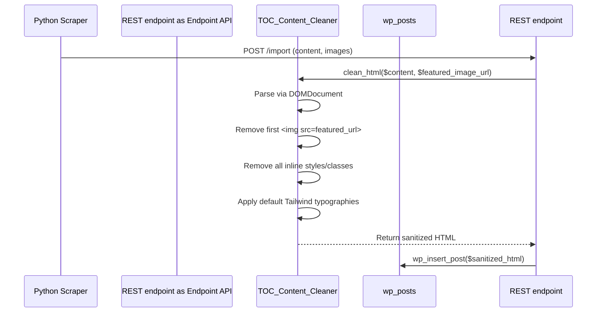

# Data Model: Clean Scraped Content

There are no new database tables or relationships introduced. This feature mutates incoming JSON payloads and HTML content strings within the lifecycle of the WordPress import REST endpoint.

## Transformed Entities

### WordPress Post Content (`post_content` string)
The raw string provided in the `content` field of the REST payload (`POST /tasteofcinemascraped/v1/import`) is transformed right before standard sanitization and insertion (`wp_insert_post()`).

**Pre-computation State (Raw HTML)**: Focus is on unstructured or inline-styled tags:
- ``
- `
...
`
- `<h2 class="random-site-header">Section</h2>`

**Post-computation State (Transformed HTML)**: Focus on structural purity and design system alignment:
- The first image, if its `src` equals the target duplication source, is dropped.
- All nodes iteratively stripped of `style` and `class` attributes.
- Specific nodes (`p`, `h1`-`h6`, `ul`, `ol`, `blockquote`, `img`, `a`, `table`) are injected with a predefined mapping of Tailwind CSS utility classes. 

## Flow Validation

